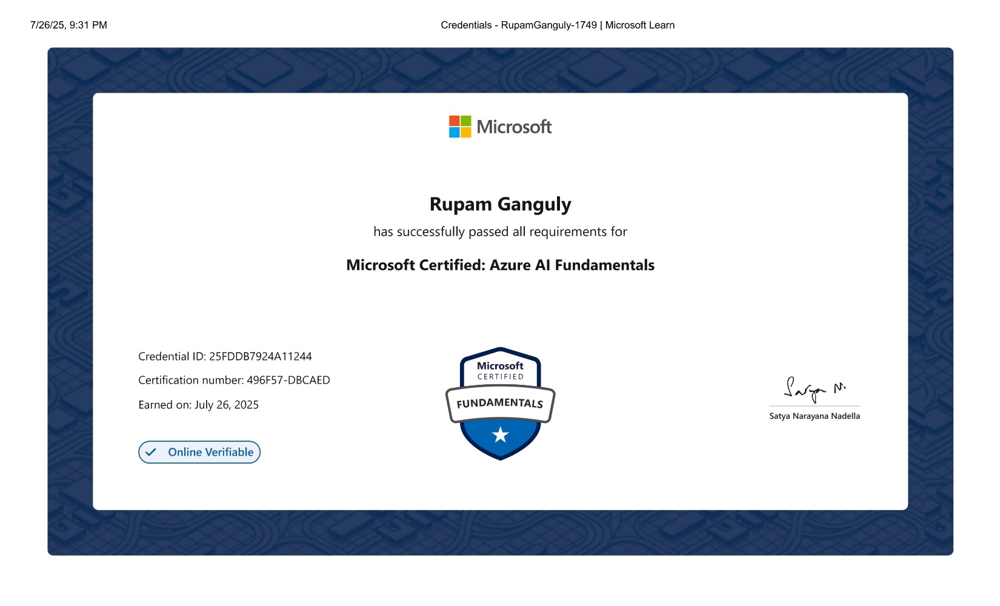

<!-- HEADER -->

 

  <b>ML Lead @ GDG Mathura</b> 
  <i>Building intelligent systems that fuse AI, IoT & Advanced Automation.</i>

<!-- Blue Line -->

  

---

<!-- ABOUT ME -->
<h2 align="center">About Me</h2>

  

🎯 AIoT Developer & Full-Stack Engineer  
🧠 ML Engineer specializing in CV, NLP, LLMs & RAG  
🤖 Robotics, automation & embedded systems enthusiast  
🌐 Cloud developer working with Azure/GCP  
📣 Speaker, mentor & open-source contributor  

---

<!-- EXPERIENCE -->
<h2 align="center">Experience</h2>

  

### 🔹 **Machine Learning Lead — GDG Mathura (2025–Present)**
- Led ML/GenAI open-source projects during Hacktoberfest  
- Conducted practical, beginner-friendly ML workshops  
- Mentored developers on PR/MR workflows  

### 🔹 **Public Relations Team — GDG Mathura (2024–2025)**
- Lead coordinator for Nvision workshops  
- Generated **500+ leads** & **200+ event participants**

### 🔹 **Data Analyst Intern — SkillCred (2024)**
- Automated analytics pipelines with advanced Excel  
- Analyzed ODA cost trends for QuickShip Logistics  

---

<!-- PROJECTS -->
<h2 align="center">Highlight Projects</h2>

  

### 🚨 **SARV – Surveillance & Rescue Vehicle**
Raspberry Pi rover with multiprocessing, OLED UI, ultrasonic sensors, environmental monitoring, and real-time controls.

### 🚗 **KAVACH – Smart ADAS (Level-2)**
Drowsiness detection (EAR), real-time braking, ultrasonic sensors & autonomous/manual switching.

### 🏠 **SANCHAR – Offline Smart Intercom**
LAN-based video calling, ISL ↔ text/voice translation, accessibility-focused emergency system.

### 🤖 **SAKHI – Multimodal GenAI Voice Assistant**
FastAPI + GPT-4o + LangChain + Whisper/Bhashini/Sarvam hybrid transcription pipeline.

---

<!-- TECH STACK -->
<h2 align="center">Tech Stack</h2>

  

**Languages:** Python • Java • JS • C • SQL  
**AI/ML:** PyTorch • TensorFlow • Transformers • LangChain  
**Backend:** FastAPI • Flask • Node.js • Express  
**Frontend:** React • EJS • HTML/CSS  
**Databases:** MongoDB • MySQL • SQLite • MS SQL  
**Cloud:** Azure • Google Cloud  
**IoT:** Raspberry Pi • ESP8266 • Sensors • Drivers  
**Tools:** Docker • Git • VSCode • PyCharm • Figma  

---

<!-- ACHIEVEMENTS -->
<h2 align="center">Achievements</h2>

  

🏆 1st — Tech Expo (SARV)  
🥇 1st — E-Summit’24 Startup Expo  
🥈 Top-2 — SIH University Round  
🏅 Top-5 — GeekVerse Hackathon  
📜 Microsoft AI-900 Certified  

---

<h2 align="center">Certifications</h2>

  

<!-- STATS -->
<h2 align="center">GitHub Stats</h2>

  

### ⭐ Profile Stats  

### 🔥 Streak Stats  

### 🧠 Top Languages  

---

<!-- PINNED -->
<h2 align="center">Top Repositories</h2>

  

  
  &nbsp;&nbsp;
  

---

<!-- CONTACT -->
<h2 align="center">Connect With Me</h2>

  

<table align="center">
  <tr>
    <td align="center">
      <a href="mailto:rupam.ganguly46@gmail.com">
         Email
      </a>
    </td>
    <td align="center">
      <a href="https://linkedin.com/in/rupam-ganguly-88329328b">
         LinkedIn
      </a>
    </td>
    <td align="center">
      <a href="https://github.com/RupamGanguly46">
         GitHub
      </a>
    </td>
    <td align="center">
      <a href="https://leetcode.com/RupamGanguly46">
         LeetCode
      </a>
    </td>
    <td align="center">
      <a href="https://twitter.com/rupamganguly46">
         Twitter
      </a>
    </td>
  </tr>
</table>

  

